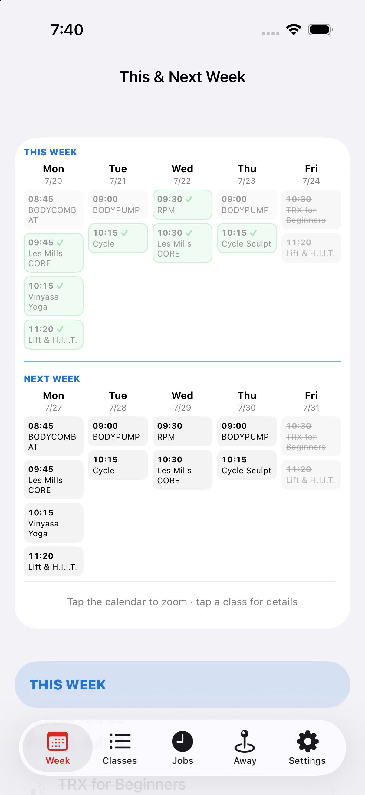
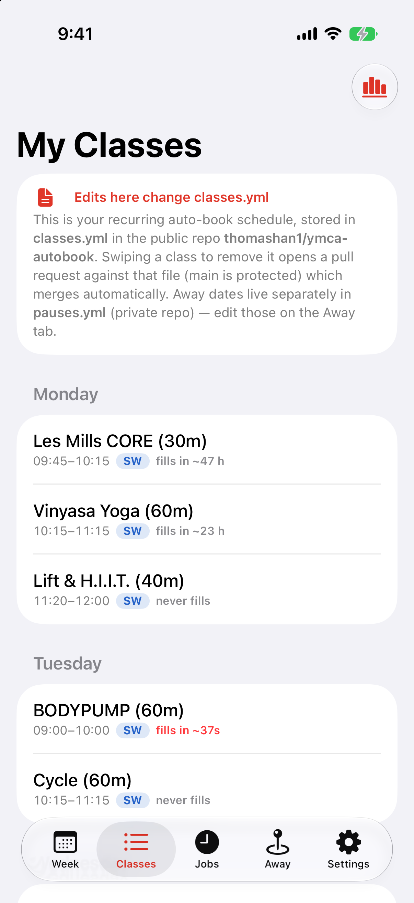
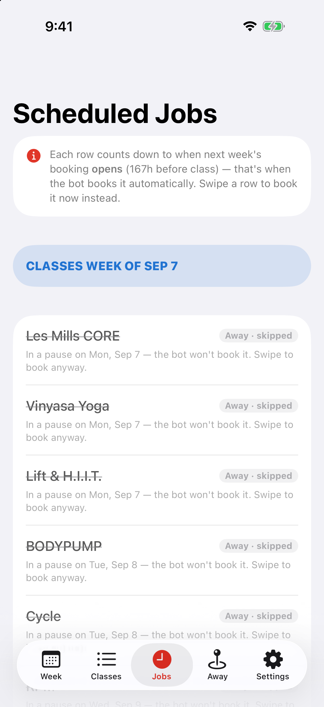
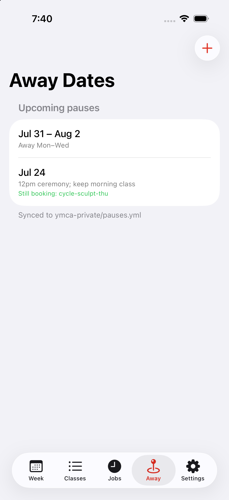
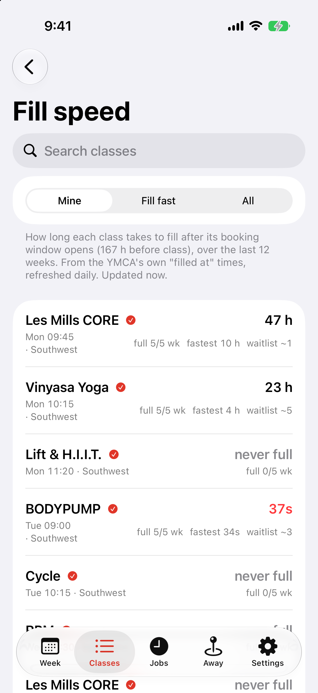
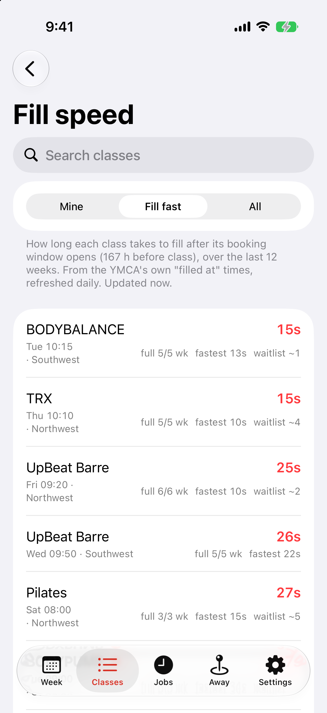
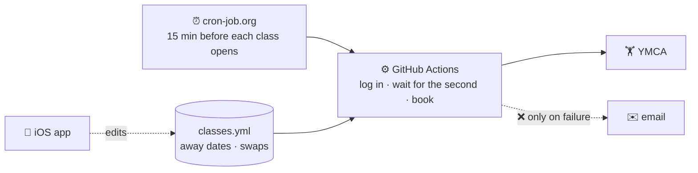

# ymca-autobook

Automatically books recurring Silicon Valley YMCA classes the second they open.

Each class opens for booking **167 hours before it starts**, i.e. a week ahead, one
hour after the class time (a Thursday 10:15 class opens the prior Thursday at 11:15).
This bot logs in just before, waits for that exact second, and books it.

## 📱 iOS app

A companion app in [`ios/`](ios/) for checking and steering it from your phone or iPad.
It doesn't book anything itself. See [`ios/README.md`](ios/README.md).

| This & Next Week | My Classes | Scheduled Jobs | Away Dates |
|:---:|:---:|:---:|:---:|
|  |  |  |  |

- **Week**: two weeks of classes; green ✓ means actually booked.
- **Classes**: your recurring lineup and how fast each class fills.
- **Jobs**: countdowns to each booking window, with a **Book now** swipe.
- **Away**: away dates and one-off swaps.

### Fill speed

| Mine | Fill fast |
|:---:|:---:|
|  |  |

How long every class at both branches takes to fill once booking opens, over the
last 12 weeks. BODYPUMP fills in ~37 seconds every week; most classes take hours or
never fill.

_Screenshots use sample data; the Fill speed numbers are real (10/10)._

## How it works



1. **cron-job.org** starts a GitHub Actions run shortly before each class's window opens.
2. The run **logs in**, finds the class, and skips it if you're away that day.
3. It **waits** for the exact opening second and **books**.
4. You get an **email only if something goes wrong**.

The full diagrams and the reasoning behind them are in
[`docs/architecture.md`](docs/architecture.md).

## Your classes

Listed in [`classes.yml`](classes.yml):

```yaml
classes:
  - key: vinyasa-yoga-mon     # short unique name
    name: "Vinyasa Yoga"      # exact title on the YMCA schedule
    weekday: Mon
    start: "10:15"
    location_ids: [1392]      # Southwest = 1392, Northwest = 1388
```

After changing it, run `.venv/bin/python scripts/gen_workflow.py` and commit both files.

## Away dates and swaps

Both live in a separate **private** repo, so they never appear here.

- **`pauses.yml`**: dates to skip, optionally keeping specific classes
  ([example](pauses.example.yml)).
- **`swaps.yml`**: on one date, take a different class instead of a recurring one
  ([example](swaps.example.yml)). Your original class is only cancelled once the
  replacement is actually booked.

## Setup

```bash
/usr/bin/python3 -m venv .venv
.venv/bin/python -m pip install -r requirements.txt
cp .env.example .env      # your egym login
```

GitHub Actions secrets: `EGYM_USERNAME`, `EGYM_PASSWORD`, plus optional
`PRIVATE_REPO_TOKEN` (away dates and swaps) and `NOTIFY_EMAIL` / `GMAIL_APP_PASSWORD`
(emails). Create the cron-job.org triggers with `./scripts/setup_cronjob_org.sh`.

Handy commands (`.venv/bin/python -m src.main …`):

```bash
--browse                  # what's on at both branches
--class <key> --dry-run   # find a class and its open time without booking
--book-id <id>            # book one specific class
--cancel-id <id>          # cancel a booking
```

Secrets stay in `.env` (git-ignored) and GitHub secrets, never in the repo.
