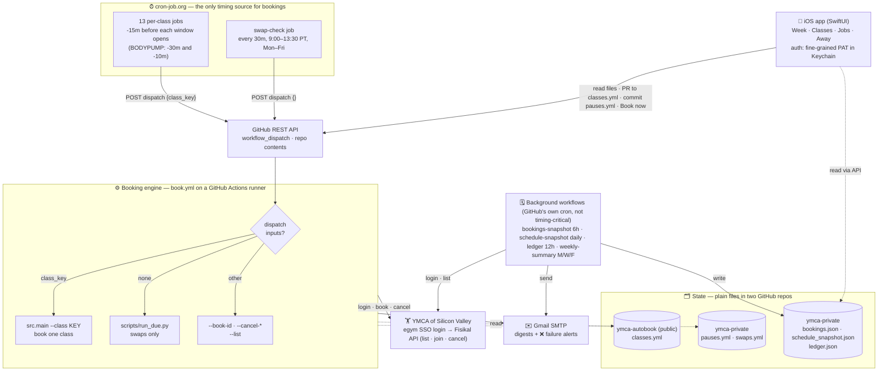
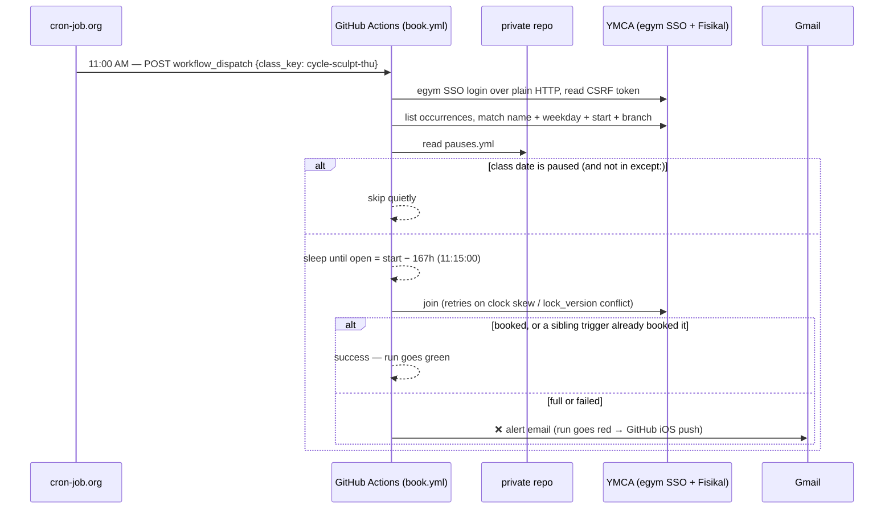

# ymca-autobook

Automatically books recurring Silicon Valley YMCA classes the moment they open.

The YMCA (Fisikal backend, egym SSO) opens each class for booking exactly **167 hours
before it starts** — that is 1 week (168h) minus 1 hour, which works out to the same
weekday one hour *after* the class start time the previous week. For example, a Thursday
10:15 AM class opens for booking the prior Thursday at 11:15 AM. The value 167h comes
directly from the API (`restrict_to_book_in_advance_time_in_hours`) and is not hardcoded.
This bot logs in, waits for that exact moment, and books next week's class for you —
running unattended on GitHub Actions.

## 📱 iOS app

A SwiftUI companion app (in [`ios/`](ios/)) is a control panel over the same
GitHub state — it does **not** book classes itself (Actions stays the engine),
it reads and steers it through the GitHub API. Universal: one build runs on
iPhone and iPad. See [`ios/README.md`](ios/README.md).

| This & Next Week | My Classes | Scheduled Jobs | Away Dates |
|:---:|:---:|:---:|:---:|
|  |  |  |  |

- **Week** — a two-week calendar grid + dated agenda, merging the recurring
  schedule with your **real bookings** (green ✓ = actually booked); tap a class
  for room/instructor. Pause days are struck through, and a **⇅ badge** marks a
  day with a one-off swap.
- **Classes** — your recurring lineup by weekday, each with how fast it
  typically fills (red when it's within 5 minutes); swipe to remove a class
  (opens an auto-merging PR against `classes.yml`).
- **Jobs** — live countdowns to each class's 167h booking-open, **grouped by the
  week they book**, with a **Book now** swipe; pause-skipped jobs are flagged.
- **Away** — the `pauses.yml` away-dates with their notes, plus upcoming one-off
  swaps from `swaps.yml` (read-only — securing a swap stays the Actions engine's
  job). Past pauses collapse behind a disclosure row.

### Fill speed

| Mine | Fill fast |
|:---:|:---:|
|  |  |

The 📊 button on **Classes** shows how long every class at both branches takes
to fill once its booking window opens, over the last 12 weeks — median,
fastest, how many weeks it filled, and the typical waitlist. **Mine** is your
lineup, **Fill fast** ranks everything that fills within 5 minutes, **All** is
searchable. It comes from the YMCA's own "filled at" timestamps, collected daily
by `scripts/update_fill_history.py` into `fill_stats.json` in the private repo.
That's where the lineup's one real race shows up: BODYPUMP fills in ~37 s every
week, while the rest take hours or never fill.

_Screenshots use sample data (the Fill speed numbers are real, as of 10/10)._

## Architecture

Three moving parts: an **external clock** (cron-job.org), a **booking engine**
(GitHub Actions making plain HTTP calls to the YMCA's Fisikal API), and **state**
kept as files in two GitHub repos. The iOS app is a window onto that state — it
never talks to the YMCA directly.



**How a single booking fire plays out** (e.g. Thursday's Cycle Sculpt, whose window
opens 11:15 AM PT a week ahead):



Key properties:

- **cron-job.org is the only clock that matters.** GitHub's own `schedule:` trigger for
  `book.yml` is paused (`gen_workflow.EMIT_SCHEDULE = False`) because since the
  2026-08-26 Actions incident it has fired hours late. The background workflows still
  use GitHub's scheduler — a few hours' delay on a snapshot or digest is harmless.
- **Correctness never depends on when the trigger lands**, only that it lands *before*
  the window: the run computes the true open instant itself and waits for it.
- **Redundant triggers are expected to race.** The loser sees `taken`, re-reads the
  occurrence, and exits quietly if the seat is ours.
- **Swaps only run on blank dispatches** (`run_due.py`), which is why `swap-check`
  exists — the per-class jobs never take that path. A blank dispatch handles swaps
  *only* (each recurring class has its own trigger) and skips the login entirely when
  none are pending.
- **Secrets** live in GitHub Actions secrets (`EGYM_*`, `PRIVATE_REPO_TOKEN`,
  `NOTIFY_EMAIL`, `GMAIL_APP_PASSWORD`) and, for cron-job.org, inside each job's
  `Authorization` header (a fine-grained PAT scoped to Actions on this repo).
  `scripts/setup_cronjob_org.sh` creates the jobs, reading its own keys from the
  local, git-ignored `.env`.

## How it works
1. **Login** (`src/login.py`) — completes the egym SSO flow over plain HTTP (no browser) and reads
   the Fisikal CSRF token. Session cookies are reused for all API calls.
2. **Find** (`src/fisikal.py`) — lists occurrences for the target branch and matches by
   **name + weekday + start time** (room and instructor ignored — they vary week to week).
3. **Pause check** (`src/pauses.py`) — if the class date falls in an away-range (see
   [Away / pause dates](#away--pause-dates)), skip it silently.
4. **Wait** (`src/schedule.py`) — computes `open = occurs_at − 167h` and waits for it.
5. **Book** (`src/fisikal.py`) — POSTs the booking; retries up to 3 times (5s apart) to
   absorb clock skew. Refreshes `lock_version` on conflicts.
6. **Notify** (`src/notify.py`) — prints result to stdout (visible in Actions job log).
   The YMCA also sends a booking confirmation email from noreply@ymcasv.org automatically.

`scripts/run_due.py` is the scheduled entrypoint: one login, loops all classes, books
whichever is opening now, skips the rest cheaply. `scripts/gen_workflow.py` regenerates
the GitHub Actions cron schedule from `classes.yml`.

## Configure your classes
Edit [`classes.yml`](classes.yml) — one entry per recurring class:

```yaml
timezone: America/Los_Angeles
classes:
  - key: vinyasa-yoga-mon       # unique slug used in CLI and cron comments
    name: "Vinyasa Yoga"        # exact title from the YMCA schedule
    weekday: Mon
    start: "10:15"              # local start time
    location_ids: [1392]        # branch: Southwest=1392, Northwest=1388
```

After editing, regenerate the workflow:
```bash
.venv/bin/python scripts/gen_workflow.py   # rewrites .github/workflows/book.yml
git add classes.yml .github/workflows/book.yml && git commit && git push
```

## Away / pause dates
Away-dates are kept in a **separate private repo** (`thomashan1/ymca-private`) so they
never appear in this public repo. Create a `pauses.yml` there following
[`pauses.example.yml`](pauses.example.yml):

```yaml
pauses:
  - {start: 2026-07-03, end: 2026-07-03}   # single day off
  - {start: 2026-07-06, end: 2026-07-06, except: [lift-hiit-mon]}  # off, but keep one class
  - {start: 2026-07-07, end: 2026-07-12}   # away week; resume Mon 7/13
```

Use `except` to keep booking specific classes on a paused day — list their **keys**
(from [`classes.yml`](classes.yml)). Everything else on those dates is still skipped.

The bot matches on the **class date** (not the run date) — booking opens ~7 days ahead,
so the run that would book a paused class fires a week earlier. Add `PRIVATE_REPO_TOKEN`
(a GitHub PAT with `contents:read` on the private repo) to your Actions secrets to enable
this. Fail-open: a missing or broken token means "no pauses" so a misconfiguration can
never silently stop bookings.

## One-off swaps
A swap is a single-date exception: miss a recurring class that day and take a different
one instead. It lives beside `pauses.yml` in the same private repo as `swaps.yml`,
following [`swaps.example.yml`](swaps.example.yml):

```yaml
swaps:
  - date: 2026-08-18        # the CLASS date, not the run date
    skip: cycle-tue         # a key from classes.yml (optional)
    book:                   # the replacement (optional)
      name: "BODYCOMBAT"
      start: "09:50"
      location_ids: [1388]
```

The replacement is described by **name + start + branch**, never an occurrence id —
ids change week to week and can only be found by browsing, so they can't be written
ahead of the booking window. Omit `book` for a one-day skip, or `skip` to add a class
without displacing anything.

**The original is never released until the replacement is booked.** If the replacement
is full, errors, or its window hasn't opened yet, the recurring class stays on your
roster; once the replacement lands, the original is cancelled automatically. So the
worst case is keeping the class you already had, never an empty slot. A replacement
still unbooked after its window has opened fails the run and sends a ❌ email, because
a swap that silently never executes looks exactly like an ordinary week.

Swaps have **no schedule of their own** — `run_due.py` applies them on `book.yml`'s
existing cron fires. That's deliberate: a purpose-built one-off cron fired 46 minutes
late, while `book.yml`'s long-established crons have never been more than 19 minutes
late across 100 runs.

## Local setup & testing
```bash
/usr/bin/python3 -m venv .venv
.venv/bin/python -m pip install -r requirements.txt

cp .env.example .env    # fill in EGYM_USERNAME / EGYM_PASSWORD
set -a; . ./.env; set +a
```

Useful commands (run from repo root via `.venv/bin/python -m src.main`):
```bash
--browse                   # Mon–Fri 9:30–15:00 classes at both branches (no fee/dance/swim)
--list [name]              # print upcoming occurrences with open times
--class <key> --dry-run    # find the target + open time, don't book
--class <key> --book-now   # skip the wait and book immediately (testing)
--book-id <occ_id>         # book any occurrence by id (testing with a random class)
--cancel-id <occ_id>       # cancel a booking by occurrence id
python scripts/run_due.py  # what the scheduler runs: book whatever's due now
python scripts/weekly_summary.py  # preview this week's booked-class digest
```

## Deploy to GitHub Actions
1. Push this repo (`.gitignore` keeps `.env` and `*.har` out).
2. In **Settings → Secrets and variables → Actions**, add:
   - `EGYM_USERNAME`, `EGYM_PASSWORD` — your egym login
   - `PRIVATE_REPO_TOKEN` *(optional)* — PAT for reading `pauses.yml` from the private repo
   - `NOTIFY_EMAIL`, `GMAIL_APP_PASSWORD` *(optional)* — enables the weekly summary email,
     and an email alert (with a ❌ subject) whenever a booking attempt fails
3. The booking workflow runs on the generated cron schedule. You can also trigger it
   manually from the **Actions** tab → *Book YMCA classes* → *Run workflow*:
   - **Class key**: book a specific class immediately (blank = schedule decides)
   - **Cancel id**: cancel an existing booking by occurrence id
4. The weekly summary workflow (`weekly-summary.yml`) runs automatically Mon 8am + Fri
   3pm PT and writes a class calendar to the Actions job summary. It also emails an HTML
   calendar if `NOTIFY_EMAIL` and `GMAIL_APP_PASSWORD` are set.

### Timing notes
- Booking correctness never depends on cron: the script computes the true open instant in
  Pacific time and waits for it. The trigger only needs to fire shortly before.
- Triggers come from **cron-job.org** (see [Architecture](#architecture)): one job per
  class at -15 min, two (-30/-10 min) for BODYPUMP, plus `swap-check` for one-off swaps.
  cron-job.org schedules in `America/Los_Angeles` natively, so there are no PDT/PST twins.
  Create/refresh them with `./scripts/setup_cronjob_org.sh` (idempotent by job title).
- GitHub's own cron for `book.yml` is paused (`EMIT_SCHEDULE = False` in
  `scripts/gen_workflow.py`) after it began firing hours late in late August 2026. Flip it
  back and regenerate once GitHub's scheduler is reliable again; until then it simply
  isn't emitted.

## Security
- `*.har`, `.env`, and `capture/` are git-ignored. Credentials live only in env vars /
  GitHub secrets — never in the repo.
- Away-dates live in a separate private repo (`thomashan1/ymca-private`), not here.
