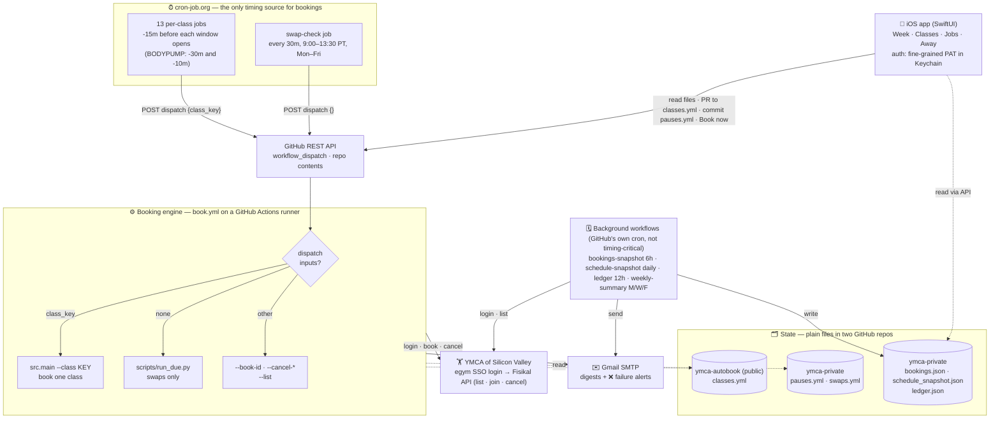
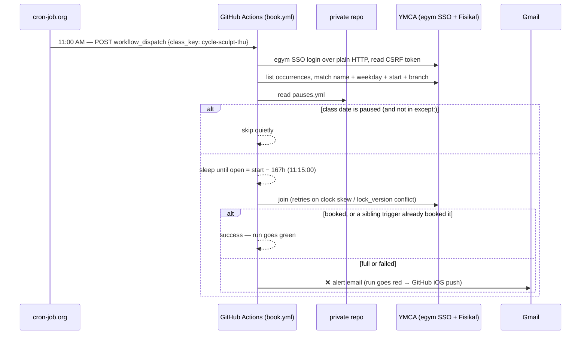

# Architecture

The detail behind the README's one-picture overview.

Three moving parts: an **external clock** (cron-job.org), a **booking engine**
(GitHub Actions making plain HTTP calls to the YMCA's Fisikal API), and **state**
kept as files in two GitHub repos. The iOS app is a window onto that state — it
never talks to the YMCA directly.

**How a single booking fire plays out** (e.g. Thursday's Cycle Sculpt, whose window
opens 11:15 AM PT a week ahead):

Key properties:

- **cron-job.org is the only clock that matters.** GitHub's own `schedule:` trigger for
  `book.yml` is paused (`gen_workflow.EMIT_SCHEDULE = False`) because since the
  2026-08-26 Actions incident it has fired hours late. The background workflows still
  use GitHub's scheduler — a few hours' delay on a snapshot or digest is harmless.
- **Correctness never depends on when the trigger lands**, only that it lands *before*
  the window: the run computes the true open instant itself and waits for it.
- **Redundant triggers are expected to race.** The loser sees `taken`, re-reads the
  occurrence, and exits quietly if the seat is ours.
- **Swaps only run on blank dispatches** (`run_due.py`), which is why `swap-check`
  exists — the per-class jobs never take that path. A blank dispatch handles swaps
  *only* (each recurring class has its own trigger) and skips the login entirely when
  none are pending.
- **Secrets** live in GitHub Actions secrets (`EGYM_*`, `PRIVATE_REPO_TOKEN`,
  `NOTIFY_EMAIL`, `GMAIL_APP_PASSWORD`) and, for cron-job.org, inside each job's
  `Authorization` header (a fine-grained PAT scoped to Actions on this repo).
  `scripts/setup_cronjob_org.sh` creates the jobs, reading its own keys from the
  local, git-ignored `.env`.

## The booking run, step by step
1. **Login** (`src/login.py`) — completes the egym SSO flow over plain HTTP (no browser) and reads
   the Fisikal CSRF token. Session cookies are reused for all API calls.
2. **Find** (`src/fisikal.py`) — lists occurrences for the target branch and matches by
   **name + weekday + start time** (room and instructor ignored — they vary week to week).
3. **Pause check** (`src/pauses.py`) — if the class date falls in an away-range (see
   [away dates](../README.md#away-dates-and-swaps)), skip it silently.
4. **Wait** (`src/schedule.py`) — computes `open = occurs_at − 167h` and waits for it.
5. **Book** (`src/fisikal.py`) — POSTs the booking; retries up to 3 times (5s apart) to
   absorb clock skew. Refreshes `lock_version` on conflicts.
6. **Notify** (`src/notify.py`) — prints result to stdout (visible in Actions job log).
   The YMCA also sends a booking confirmation email from noreply@ymcasv.org automatically.

`scripts/run_due.py` handles blank dispatches (`swap-check`): it applies one-off swaps
and skips the recurring classes, which each have their own trigger. `scripts/gen_workflow.py` regenerates
the GitHub Actions cron schedule from `classes.yml`.

## Timing notes
- Booking correctness never depends on cron: the script computes the true open instant in
  Pacific time and waits for it. The trigger only needs to fire shortly before.
- Triggers come from **cron-job.org** (see the diagram above): one job per
  class at -15 min, two (-30/-10 min) for BODYPUMP, plus `swap-check` for one-off swaps.
  cron-job.org schedules in `America/Los_Angeles` natively, so there are no PDT/PST twins.
  Create/refresh them with `./scripts/setup_cronjob_org.sh` (idempotent by job title).
- GitHub's own cron for `book.yml` is paused (`EMIT_SCHEDULE = False` in
  `scripts/gen_workflow.py`) after it began firing hours late in late August 2026. Flip it
  back and regenerate once GitHub's scheduler is reliable again; until then it simply
  isn't emitted.
